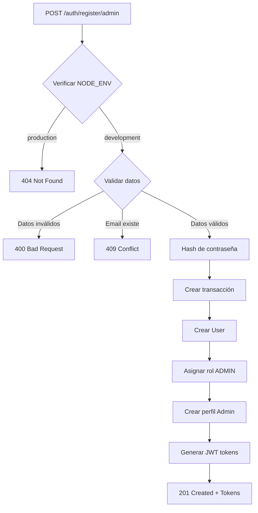

# Registro de Administradores (Solo Desarrollo)

## ⚠️ ADVERTENCIA IMPORTANTE

Este endpoint **SOLO está disponible en entornos de desarrollo** (NODE_ENV !== 'production').

En producción, este endpoint retorna **404 Not Found** por razones de seguridad.

---

## 🎯 Descripción General

Este es un endpoint especial para facilitar el desarrollo y testing, permitiendo crear administradores rápidamente sin necesidad de usar el endpoint administrativo que requiere autenticación previa.

**Funcionalidad:**
1. Crea un usuario con credenciales
2. Asigna el rol `ADMIN`
3. Crea el perfil de administrador
4. Retorna tokens JWT para iniciar sesión inmediatamente
5. **Solo funciona en desarrollo** - validado mediante `NODE_ENV`

---

## 🚀 Endpoint

### POST `/auth/register/admin`

**Acceso:** 
- ✅ Público en **desarrollo** (NODE_ENV !== 'production')
- ❌ **404 Not Found** en **producción** (NODE_ENV === 'production')

---

## 🔒 Validación de Entorno

```typescript
// Validación en el controlador
const nodeEnv = this.configService.get<string>('NODE_ENV', 'development');

if (nodeEnv === 'production') {
  throw new NotFoundException(); // Retorna 404
}
```

### Variables de Entorno

```bash
# Desarrollo - Endpoint disponible
NODE_ENV=development
# o simplemente no definir NODE_ENV (default: development)

# Producción - Endpoint retorna 404
NODE_ENV=production
```

---

## 📋 Request Body

```json
{
  "email": "admin@example.com",
  "password": "AdminPass123",
  "firstName": "Admin",
  "lastName": "User",
  "username": "admin_user",      // Opcional
  "phone": "+1234567890",         // Opcional
  "bio": "System administrator",  // Opcional
  "acceptTerms": true             // Requerido
}
```

### Campos Requeridos

| Campo | Tipo | Descripción |
|-------|------|-------------|
| `email` | string | Email del administrador (debe ser único) |
| `password` | string | Contraseña (mínimo 6 caracteres) |
| `firstName` | string | Nombre del administrador (mínimo 2 caracteres) |
| `lastName` | string | Apellido del administrador (mínimo 2 caracteres) |
| `acceptTerms` | boolean | Debe ser `true` para aceptar términos y condiciones |

### Campos Opcionales

| Campo | Tipo | Descripción |
|-------|------|-------------|
| `username` | string | Nombre de usuario (debe ser único si se proporciona, 3-50 caracteres) |
| `phone` | string | Número de teléfono (máximo 20 caracteres) |
| `bio` | string | Biografía del administrador (máximo 1000 caracteres) |

---

## ✅ Respuesta Exitosa (201 Created)

**Solo en desarrollo:**

```json
{
  "success": true,
  "message": "Admin registered successfully",
  "user": {
    "id": "550e8400-e29b-41d4-a716-446655440000",
    "email": "admin@example.com",
    "username": "admin_user",
    "firstName": "Admin",
    "lastName": "User",
    "phone": "+1234567890",
    "bio": "System administrator",
    "isOnline": false,
    "isActive": true,
    "isVerified": true,
    "roles": "admin",
    "admin": {
      "id": "550e8400-e29b-41d4-a716-446655440000",
      "firstName": "Admin",
      "lastName": "User",
      "email": "admin@example.com",
      "phone": "+1234567890",
      "bio": "System administrator",
      "isActive": true,
      "userId": "550e8400-e29b-41d4-a716-446655440000",
      "createdAt": "2024-01-01T00:00:00.000Z",
      "updatedAt": "2024-01-01T00:00:00.000Z"
    },
    "createdAt": "2024-01-01T00:00:00.000Z",
    "updatedAt": "2024-01-01T00:00:00.000Z"
  },
  "accessToken": "eyJhbGciOiJIUzI1NiIsInR5cCI6IkpXVCJ9...",
  "refreshToken": "eyJhbGciOiJIUzI1NiIsInR5cCI6IkpXVCJ9...",
  "expiresIn": 3600,
  "refreshExpiresIn": 604800
}
```

---

## ❌ Respuestas de Error

### 404 Not Found - Producción

**En producción (NODE_ENV === 'production'):**

```json
{
  "statusCode": 404,
  "message": "Not Found"
}
```

### 400 Bad Request - Términos no aceptados

```json
{
  "statusCode": 400,
  "message": "You must accept the terms and conditions to register",
  "error": "Bad Request"
}
```

### 409 Conflict - Email ya existe

```json
{
  "statusCode": 409,
  "message": "User with this email already exists",
  "error": "Conflict"
}
```

### 409 Conflict - Username ya existe

```json
{
  "statusCode": 409,
  "message": "Username already taken",
  "error": "Conflict"
}
```

---

## 🔧 Ejemplos de Uso

### cURL - Desarrollo

```bash
# En desarrollo (NODE_ENV=development o no definido)
curl -X POST http://localhost:3000/auth/register/admin \
  -H "Content-Type: application/json" \
  -d '{
    "email": "newadmin@example.com",
    "password": "AdminPass123",
    "firstName": "Super",
    "lastName": "Admin",
    "username": "superadmin",
    "phone": "+1987654321",
    "bio": "Main system administrator",
    "acceptTerms": true
  }'
```

### cURL - Producción

```bash
# En producción (NODE_ENV=production)
curl -X POST http://localhost:3000/auth/register/admin \
  -H "Content-Type: application/json" \
  -d '{
    "email": "admin@example.com",
    "password": "AdminPass123",
    "firstName": "Admin",
    "lastName": "User",
    "acceptTerms": true
  }'

# Respuesta: 404 Not Found
{
  "statusCode": 404,
  "message": "Not Found"
}
```

### JavaScript (Fetch)

```javascript
const registerAdmin = async (adminData) => {
  try {
    const response = await fetch('http://localhost:3000/auth/register/admin', {
      method: 'POST',
      headers: {
        'Content-Type': 'application/json',
      },
      body: JSON.stringify({
        email: adminData.email,
        password: adminData.password,
        firstName: adminData.firstName,
        lastName: adminData.lastName,
        username: adminData.username,
        phone: adminData.phone,
        bio: adminData.bio,
        acceptTerms: true,
      }),
    });

    if (response.status === 404) {
      throw new Error('Endpoint not available (production environment)');
    }

    const data = await response.json();

    if (response.ok) {
      // Guardar tokens
      localStorage.setItem('accessToken', data.accessToken);
      localStorage.setItem('refreshToken', data.refreshToken);
      
      console.log('Admin registered successfully:', data.user);
      return data;
    } else {
      console.error('Registration failed:', data.message);
      throw new Error(data.message);
    }
  } catch (error) {
    console.error('Error during registration:', error);
    throw error;
  }
};

// Uso
registerAdmin({
  email: 'admin@example.com',
  password: 'AdminPass123',
  firstName: 'Admin',
  lastName: 'User',
  username: 'adminuser',
});
```

---

## 🔐 Características de Seguridad

### 1. Validación de Entorno
- ✅ Solo disponible si `NODE_ENV !== 'production'`
- ✅ Retorna 404 en producción (no revela su existencia)
- ✅ Usa `ConfigService` para leer variable de entorno

### 2. Validaciones de Datos
- ✅ Hash de contraseña con `CryptoService`
- ✅ Validación de email único
- ✅ Validación de username único
- ✅ Términos y condiciones obligatorios
- ✅ Transacción atómica (todo o nada)

### 3. Diferencias con Estudiantes
- ✅ Administradores se crean con `isVerified: true` (verificados por defecto)
- ✅ Estudiantes se crean con `isVerified: false` (requieren verificación)

---

## 📊 Flujo de Validación



---

## 💡 Casos de Uso

### Desarrollo Local

```bash
# Crear primer admin para desarrollo
NODE_ENV=development npm run start:dev

# En otra terminal
curl -X POST http://localhost:3000/auth/register/admin \
  -H "Content-Type: application/json" \
  -d '{
    "email": "dev@example.com",
    "password": "DevPass123",
    "firstName": "Dev",
    "lastName": "Admin",
    "acceptTerms": true
  }'
```

### Testing E2E

```typescript
// test/auth.e2e-spec.ts
describe('Admin Registration (Development)', () => {
  it('should allow admin registration in development', async () => {
    process.env.NODE_ENV = 'development';
    
    const response = await request(app.getHttpServer())
      .post('/auth/register/admin')
      .send({
        email: 'test-admin@example.com',
        password: 'TestPass123',
        firstName: 'Test',
        lastName: 'Admin',
        acceptTerms: true,
      })
      .expect(201);

    expect(response.body.success).toBe(true);
    expect(response.body.user.roles).toBe('admin');
  });

  it('should return 404 in production', async () => {
    process.env.NODE_ENV = 'production';
    
    await request(app.getHttpServer())
      .post('/auth/register/admin')
      .send({
        email: 'admin@example.com',
        password: 'AdminPass123',
        firstName: 'Admin',
        lastName: 'User',
        acceptTerms: true,
      })
      .expect(404);
  });
});
```

---

## ⚖️ Comparación con Otros Endpoints

| Característica | `/auth/register/admin` | `/auth/register/student` | `/admins` (POST) |
|----------------|----------------------|-------------------------|------------------|
| **Disponibilidad** | ⚠️ Solo desarrollo | ✅ Siempre (público) | ✅ Siempre (protegido) |
| **Autenticación** | ❌ No requiere | ❌ No requiere | ✅ Requiere (ADMIN) |
| **Entorno** | 🔧 Development only | 🌍 Todos | 🌍 Todos |
| **Rol asignado** | ADMIN | STUDENT | N/A (requiere userId) |
| **isVerified** | true | false | Según user |
| **Tokens JWT** | ✅ Retornados | ✅ Retornados | ❌ No |
| **Uso** | Testing/Development | Auto-registro | Creación administrativa |

---

## 🧪 Testing

### Prueba en Desarrollo

```bash
# 1. Asegurarse de estar en desarrollo
export NODE_ENV=development

# 2. Registrar admin
curl -X POST http://localhost:3000/auth/register/admin \
  -H "Content-Type: application/json" \
  -d '{
    "email": "test-admin@example.com",
    "password": "Test123456",
    "firstName": "Test",
    "lastName": "Admin",
    "acceptTerms": true
  }'

# 3. Usar el accessToken para verificar
curl -X GET http://localhost:3000/auth/profile \
  -H "Authorization: Bearer {accessToken_from_step_2}"
```

### Prueba en Producción

```bash
# 1. Configurar como producción
export NODE_ENV=production

# 2. Intentar registrar admin (debe fallar con 404)
curl -X POST http://localhost:3000/auth/register/admin \
  -H "Content-Type: application/json" \
  -d '{
    "email": "admin@example.com",
    "password": "AdminPass123",
    "firstName": "Admin",
    "lastName": "User",
    "acceptTerms": true
  }'

# Respuesta esperada: 404 Not Found
```

---

## 🚨 Advertencias de Seguridad

### ⚠️ NO usar en producción

Este endpoint está **deshabilitado en producción** por las siguientes razones:

1. **Seguridad**: Permitir creación pública de administradores es un riesgo de seguridad
2. **Control de acceso**: Los administradores deben ser creados solo por otros administradores
3. **Auditoría**: En producción debe haber trazabilidad de quién creó cada admin

### ✅ Alternativas en Producción

Para crear administradores en producción, usar:

```bash
# 1. Como ADMIN autenticado, usar endpoint protegido
POST /admins
Headers: Authorization: Bearer {admin_token}
Body: {
  "userId": "existing-user-uuid",
  "firstName": "Admin",
  "lastName": "User",
  "email": "admin@example.com",
  ...
}
```

---

## 📝 Notas Importantes

### Valor por Defecto de NODE_ENV

Si `NODE_ENV` no está definido, el valor por defecto es `'development'`:

```typescript
const nodeEnv = this.configService.get<string>('NODE_ENV', 'development');
```

Esto significa que el endpoint está **disponible** si:
- `NODE_ENV` no está definido
- `NODE_ENV=development`
- `NODE_ENV=dev`
- `NODE_ENV=test`
- Cualquier valor excepto `'production'`

### isVerified por Defecto

Los administradores registrados con este endpoint tienen `isVerified: true` por defecto, mientras que los estudiantes tienen `isVerified: false`.

---

## 🔗 Endpoints Relacionados

- `POST /auth/login` - Iniciar sesión
- `POST /auth/register/student` - Registrar estudiante (siempre disponible)
- `POST /admins` - Crear admin (requiere autenticación ADMIN)
- `GET /auth/profile` - Obtener perfil autenticado

---

## 📚 Documentación Relacionada

- [Registro de Estudiantes](./STUDENT_REGISTRATION.md)
- [Ejemplos de API](./API_EXAMPLES.md)
- [Sistema de Permisos](./PERMISSIONS_SYSTEM.md)
- [Variables de Entorno](./SETUP.md)

---

## 🐛 Troubleshooting

### El endpoint retorna 404 en desarrollo

**Posible causa:** NODE_ENV está configurado como 'production'

**Solución:**
```bash
# Verificar variable de entorno
echo $NODE_ENV

# Si es 'production', cambiar a development
export NODE_ENV=development

# O eliminar la variable
unset NODE_ENV
```

### Error: "User with this email already exists"

**Solución:** El email ya está registrado. Usar un email diferente o eliminar el usuario existente de la base de datos.

### El endpoint funciona en producción

**Problema:** Esto NO debería pasar. Verificar que:
1. `NODE_ENV=production` esté configurado correctamente
2. El código del controlador esté usando `ConfigService` correctamente
3. No hay caché del build anterior

---

## ✅ Checklist de Seguridad

- ✅ Endpoint deshabilitado en producción
- ✅ Retorna 404 (no revela su existencia)
- ✅ Usa ConfigService para validar entorno
- ✅ Hash de contraseñas
- ✅ Validación de datos
- ✅ Transacción atómica
- ✅ Documentado como "DEVELOPMENT ONLY"

---

## 🎉 Conclusión

Este endpoint facilita el desarrollo y testing, pero está **completamente deshabilitado en producción** por seguridad. Úsalo libremente en desarrollo, pero recuerda que en producción los administradores deben crearse mediante el flujo administrativo protegido.

