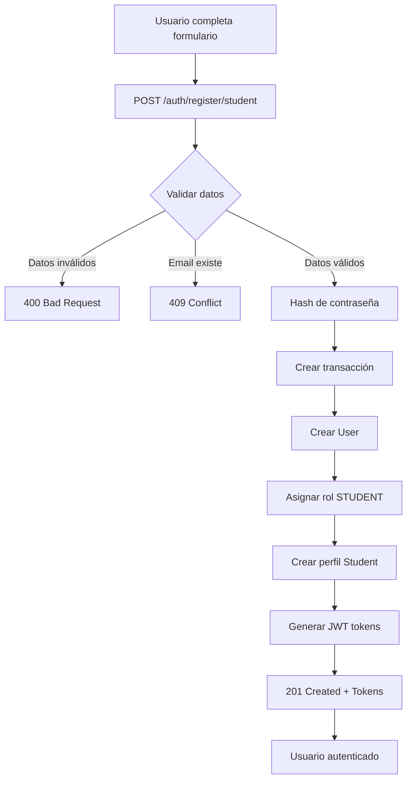

# Registro Público de Estudiantes

## 📝 Descripción General

Los estudiantes ahora pueden registrarse por sí mismos en la plataforma sin necesidad de que un administrador o coordinador los cree. Este es un endpoint público que automáticamente:

1. Crea un usuario con credenciales
2. Asigna el rol `STUDENT`
3. Crea el perfil de estudiante
4. Retorna tokens JWT para iniciar sesión inmediatamente

---

## 🚀 Endpoint

### POST `/auth/register/student`

**Acceso:** Público (no requiere autenticación)

---

## 📋 Request Body

```json
{
  "email": "student@example.com",
  "password": "SecurePass123",
  "firstName": "John",
  "lastName": "Doe",
  "username": "johndoe",           // Opcional
  "phone": "+1234567890",           // Opcional
  "bio": "I love learning English!", // Opcional
  "acceptTerms": true               // Requerido
}
```

### Campos Requeridos

| Campo | Tipo | Descripción |
|-------|------|-------------|
| `email` | string | Email del estudiante (debe ser único) |
| `password` | string | Contraseña (mínimo 6 caracteres) |
| `firstName` | string | Nombre del estudiante (mínimo 2 caracteres) |
| `lastName` | string | Apellido del estudiante (mínimo 2 caracteres) |
| `acceptTerms` | boolean | Debe ser `true` para aceptar términos y condiciones |

### Campos Opcionales

| Campo | Tipo | Descripción |
|-------|------|-------------|
| `username` | string | Nombre de usuario (debe ser único si se proporciona, 3-50 caracteres) |
| `phone` | string | Número de teléfono (máximo 20 caracteres) |
| `bio` | string | Biografía del estudiante (máximo 1000 caracteres) |

---

## ✅ Respuesta Exitosa (201 Created)

```json
{
  "success": true,
  "message": "Student registered successfully",
  "user": {
    "id": "550e8400-e29b-41d4-a716-446655440000",
    "email": "student@example.com",
    "username": "johndoe",
    "firstName": "John",
    "lastName": "Doe",
    "phone": "+1234567890",
    "bio": "I love learning English!",
    "isOnline": false,
    "isActive": true,
    "isVerified": false,
    "roles": "student",
    "student": {
      "id": "550e8400-e29b-41d4-a716-446655440000",
      "firstName": "John",
      "lastName": "Doe",
      "email": "student@example.com",
      "phone": "+1234567890",
      "bio": "I love learning English!",
      "isActive": true,
      "schoolId": null,
      "userId": "550e8400-e29b-41d4-a716-446655440000",
      "createdAt": "2024-01-01T00:00:00.000Z",
      "updatedAt": "2024-01-01T00:00:00.000Z"
    },
    "createdAt": "2024-01-01T00:00:00.000Z",
    "updatedAt": "2024-01-01T00:00:00.000Z"
  },
  "accessToken": "eyJhbGciOiJIUzI1NiIsInR5cCI6IkpXVCJ9...",
  "refreshToken": "eyJhbGciOiJIUzI1NiIsInR5cCI6IkpXVCJ9...",
  "expiresIn": 3600,
  "refreshExpiresIn": 604800
}
```

### Tokens Retornados

| Campo | Descripción |
|-------|-------------|
| `accessToken` | Token JWT para autenticación (válido por 1 hora) |
| `refreshToken` | Token para renovar el accessToken (válido por 7 días) |
| `expiresIn` | Tiempo de expiración del accessToken en segundos (3600) |
| `refreshExpiresIn` | Tiempo de expiración del refreshToken en segundos (604800) |

---

## ❌ Respuestas de Error

### 400 Bad Request - Términos no aceptados

```json
{
  "statusCode": 400,
  "message": "You must accept the terms and conditions to register",
  "error": "Bad Request"
}
```

### 409 Conflict - Email ya existe

```json
{
  "statusCode": 409,
  "message": "User with this email already exists",
  "error": "Conflict"
}
```

### 409 Conflict - Username ya existe

```json
{
  "statusCode": 409,
  "message": "Username already taken",
  "error": "Conflict"
}
```

### 400 Bad Request - Validación de campos

```json
{
  "statusCode": 400,
  "message": [
    "Please provide a valid email address",
    "Password must be at least 6 characters long",
    "firstName must be at least 2 characters"
  ],
  "error": "Bad Request"
}
```

---

## 🔧 Ejemplos de Uso

### cURL

```bash
curl -X POST http://localhost:3000/auth/register/student \
  -H "Content-Type: application/json" \
  -d '{
    "email": "newstudent@example.com",
    "password": "SecurePass123",
    "firstName": "Jane",
    "lastName": "Smith",
    "username": "janesmith",
    "phone": "+1987654321",
    "bio": "Excited to learn English!",
    "acceptTerms": true
  }'
```

### JavaScript (Fetch)

```javascript
const registerStudent = async (studentData) => {
  try {
    const response = await fetch('http://localhost:3000/auth/register/student', {
      method: 'POST',
      headers: {
        'Content-Type': 'application/json',
      },
      body: JSON.stringify({
        email: studentData.email,
        password: studentData.password,
        firstName: studentData.firstName,
        lastName: studentData.lastName,
        username: studentData.username,
        phone: studentData.phone,
        bio: studentData.bio,
        acceptTerms: true,
      }),
    });

    const data = await response.json();

    if (response.ok) {
      // Guardar tokens en localStorage o cookies
      localStorage.setItem('accessToken', data.accessToken);
      localStorage.setItem('refreshToken', data.refreshToken);
      
      console.log('Student registered successfully:', data.user);
      return data;
    } else {
      console.error('Registration failed:', data.message);
      throw new Error(data.message);
    }
  } catch (error) {
    console.error('Error during registration:', error);
    throw error;
  }
};

// Uso
registerStudent({
  email: 'student@example.com',
  password: 'SecurePass123',
  firstName: 'John',
  lastName: 'Doe',
  username: 'johndoe',
  phone: '+1234567890',
  bio: 'I love learning English!',
});
```

### TypeScript (Axios)

```typescript
import axios from 'axios';

interface RegisterStudentDto {
  email: string;
  password: string;
  firstName: string;
  lastName: string;
  username?: string;
  phone?: string;
  bio?: string;
  acceptTerms: boolean;
}

interface RegisterResponse {
  success: boolean;
  message: string;
  user: any;
  accessToken: string;
  refreshToken: string;
  expiresIn: number;
  refreshExpiresIn: number;
}

const registerStudent = async (data: RegisterStudentDto): Promise<RegisterResponse> => {
  try {
    const response = await axios.post<RegisterResponse>(
      'http://localhost:3000/auth/register/student',
      data
    );
    
    return response.data;
  } catch (error) {
    if (axios.isAxiosError(error)) {
      throw new Error(error.response?.data?.message || 'Registration failed');
    }
    throw error;
  }
};

// Uso
registerStudent({
  email: 'student@example.com',
  password: 'SecurePass123',
  firstName: 'John',
  lastName: 'Doe',
  acceptTerms: true,
}).then((data) => {
  console.log('Registered successfully:', data);
});
```

---

## 🔐 Características de Seguridad

1. **Hash de Contraseña**: La contraseña se hashea usando el `CryptoService` antes de almacenarse
2. **Validación de Email**: Se verifica que el email sea único en el sistema
3. **Validación de Username**: Si se proporciona username, debe ser único
4. **Términos y Condiciones**: El campo `acceptTerms` debe ser `true`
5. **Tokens JWT**: Se generan automáticamente para autenticación inmediata

---

## 📊 Flujo de Registro



---

## 💡 Notas Importantes

### schoolId es NULL por defecto

Los estudiantes que se registran por sí mismos NO están asociados a ninguna escuela inicialmente (`schoolId: null`). Un administrador o coordinador puede asignarlos a una escuela posteriormente.

### Verificación de Email

Por defecto, los estudiantes registrados tienen `isVerified: false`. Se recomienda implementar un flujo de verificación de email posteriormente.

### Asignación a Escuela

Para asignar un estudiante a una escuela después del registro:

```bash
# Como ADMIN
PATCH /students/{student-id}
{
  "schoolId": "school-uuid"
}
```

### Múltiples Roles

Aunque este endpoint crea estudiantes con el rol `STUDENT`, un administrador puede asignar roles adicionales posteriormente si es necesario.

---

## 🧪 Testing

### Prueba Manual con cURL

```bash
# 1. Registrar nuevo estudiante
curl -X POST http://localhost:3000/auth/register/student \
  -H "Content-Type: application/json" \
  -d '{
    "email": "test@example.com",
    "password": "Test123456",
    "firstName": "Test",
    "lastName": "User",
    "acceptTerms": true
  }'

# 2. Usar el accessToken retornado para acceder al perfil
curl -X GET http://localhost:3000/auth/profile \
  -H "Authorization: Bearer {accessToken_from_step_1}"

# 3. Probar login con las credenciales creadas
curl -X POST http://localhost:3000/auth/login \
  -H "Content-Type: application/json" \
  -d '{
    "email": "test@example.com",
    "password": "Test123456"
  }'
```

---

## 🔗 Endpoints Relacionados

- `POST /auth/login` - Iniciar sesión
- `POST /auth/logout` - Cerrar sesión
- `POST /auth/refresh` - Renovar token
- `GET /auth/profile` - Obtener perfil del usuario autenticado
- `GET /auth/validate` - Validar token JWT

---

## 📚 Documentación Relacionada

- [Ejemplos de API](./API_EXAMPLES.md)
- [Sistema de Permisos](./PERMISSIONS_SYSTEM.md)
- [Arquitectura](./ARCHITECTURE.md)
- [Credenciales de Prueba](./TEST_CREDENTIALS.md)

---

## 🎯 Diferencias con el Endpoint de Creación de Estudiantes

| Característica | POST /auth/register/student | POST /students |
|----------------|----------------------------|----------------|
| Autenticación | **No requerida** (público) | Requerida (ADMIN/COORDINATOR) |
| schoolId | Opcional (null por defecto) | Requerido |
| userId | Generado automáticamente | Requerido en el body |
| Rol asignado | Automático (STUDENT) | Manual |
| Tokens JWT | Retornados automáticamente | No retornados |
| Uso | Auto-registro de estudiantes | Creación por administrador |

---

## ✅ Checklist de Implementación Frontend

- [ ] Crear formulario de registro con todos los campos
- [ ] Validar campos antes de enviar (email válido, password mínimo 6 caracteres, etc.)
- [ ] Implementar checkbox de "Aceptar términos y condiciones"
- [ ] Manejar errores (email duplicado, validación, etc.)
- [ ] Guardar tokens en localStorage/cookies al registrarse exitosamente
- [ ] Redirigir al dashboard/home después del registro exitoso
- [ ] Implementar botón "¿Ya tienes cuenta? Inicia sesión"
- [ ] Mostrar indicador de carga durante el registro
- [ ] Implementar validación en tiempo real de campos
- [ ] Agregar opción de "Mostrar/Ocultar contraseña"

---

## 🐛 Troubleshooting

### Error: "User with this email already exists"

**Solución:** El email ya está registrado. Usar un email diferente o usar el endpoint de login.

### Error: "You must accept the terms and conditions to register"

**Solución:** Asegurarse de que el campo `acceptTerms` sea `true` en el request body.

### Error: "Password must be at least 6 characters long"

**Solución:** Usar una contraseña con mínimo 6 caracteres.

### Error: "Username already taken"

**Solución:** Elegir un username diferente o no enviar el campo (es opcional).

---

## 📞 Soporte

Para más información o soporte, consultar la documentación principal o contactar al equipo de desarrollo.

